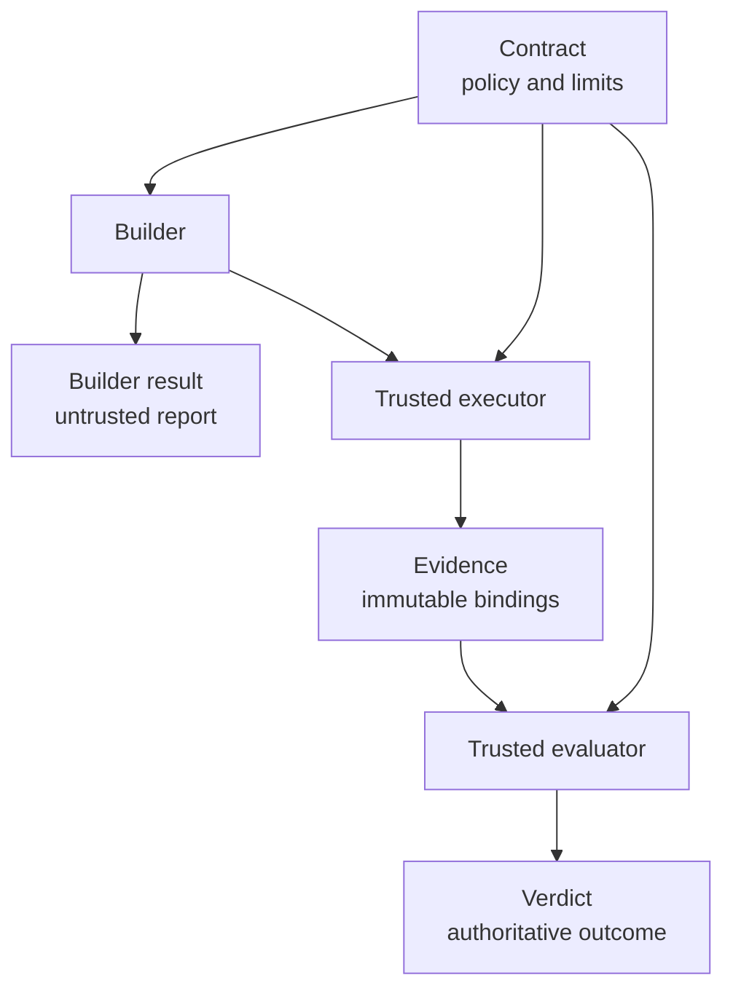

# engineering-loop-schemas

*[Português](README.pt-BR.md)*

Canonical contracts for evidence-gated engineering loops: a provider-neutral
boundary between what an AI coding agent reports, what a trusted executor
actually observed, and what an independent evaluator may approve.

The package ships four JSON Schema Draft 2020-12 documents, matching immutable
Python models, a standard-library structural validator, and a deterministic
vendor-bundle renderer. It does not run agents or promote code.

## Why this exists

An agent saying “the tests passed” is not evidence. A reliable engineering loop
needs separate identities and authority:

| Artifact | Producer | Trusted for promotion? | Purpose |
| --- | --- | ---: | --- |
| `contract` | Human/platform policy | Yes | Defines scope, budgets, allowed actions, and hard gates |
| `builder-result` | Coding agent | No | Records the builder's non-authoritative account |
| `evidence` | Trusted executor | Yes | Binds exact code, policy, environment, command argv, termination, and output hashes |
| `verdict` | Trusted evaluator | Yes | Grades evidence against the complete contract gate set |



The builder cannot produce `evidence` or a `verdict` that certifies its own
candidate. Missing or unverifiable gates fail closed.

## Security and integrity invariants

- The canonical JSON Schema is the structural source of truth. The stdlib
  evaluator loads those files and refuses to run if a schema introduces an
  unsupported assertion keyword.
- Document versions describe wire formats, not the Python package release.
- Trusted evidence carries the repository identity, complete Git object IDs,
  candidate-tree digest, contract digest, policy digest, executor environment,
  and shell-free argv for every command.
- `EXITED` requires a real integer exit code. `TIMED_OUT`, `CANCELLED`, and
  `OUTPUT_LIMIT` require `null`.
- stdout, stderr, and the immutable gate specification are hashed separately.
- A `PASS` verdict can only use `SUCCEEDED` or `NO_OP` and cannot contain a
  failed gate.
- Cross-document validation requires exactly one result for every hard gate in
  the contract; missing, duplicate, or undeclared gates are rejected.
- Vendor provenance must match `pyproject.toml`, the exact Git `HEAD`, the
  configured origin, and a clean working tree.

## Document versions

| Document | Wire version | Notes |
| --- | ---: | --- |
| `contract` | `1.0.0` | Existing report-only contract |
| `builder-result` | `1.0.0` | Non-authoritative; now requires full SHA-1 IDs |
| `evidence` | `2.0.0` | Repository/policy binding, full OIDs, executor context, structured argv |
| `verdict` | `2.0.0` | Contract digest, full candidate OID, and status/final-state consistency |

Each schema uses `const` for its version. Consumers can therefore select a
compatible parser before trusting the document. See [MIGRATION.md](MIGRATION.md)
for the breaking evidence and verdict changes.

## Repository layout

```text
schemas/                         canonical language-neutral contracts
src/loop_schemas/
  models.py                      frozen, slotted dataclasses
  _stdlib_jsonschema.py          fail-closed supported-keyword evaluator
  schema_resources.py            installed-schema resource API
  validate_contract.py           CLI and document-validation API
scripts/render_vendor_bundle.py  deterministic, provenance-checked vendoring
examples/
  harness-self-improvement.yaml
  trusted-evidence.json
  trusted-verdict.json
tests/
```

The wheel includes all four schemas under `loop_schemas/schemas/`; callers do
not need a source checkout.

## Validate documents

Validate the example contract:

```bash
uv sync --all-groups
uv run python -m loop_schemas.validate_contract \
  examples/harness-self-improvement.yaml
```

Use the library APIs:

```python
from loop_schemas import load_schema
from loop_schemas.validate_contract import (
    validate,
    validate_builder_result,
    validate_evidence,
    validate_verdict,
)

contract_errors = validate(contract)
evidence_errors = validate_evidence(evidence)
builder_errors = validate_builder_result(builder_result)
verdict_errors = validate_verdict(verdict, contract=contract)

evidence_schema = load_schema("evidence")
```

An empty list means valid. Structural failures include a JSON path. Contract
validation additionally checks:

- literal overlap between allowlist and denylist globs;
- overlap between allowed and denied actions;
- positive budgets;
- supported hard-gate names;
- trigger-specific requirements.

`validate_verdict(..., contract=contract)` additionally verifies contract
identity and exact gate-set completeness.

JSON input and all structural validation are standard-library-only. YAML input
is available when PyYAML is installed.

## Evidence and verdict examples

[trusted-evidence.json](examples/trusted-evidence.json) shows the full trusted
execution envelope. It uses a shell-free `argv`, not a display command string,
and binds all security-relevant inputs by complete identity or SHA-256.

[trusted-verdict.json](examples/trusted-verdict.json) shows a matching
authoritative result. `evidence_sha256` is defined over RFC 8785/JCS canonical
JSON bytes; producers must not hash incidental pretty-printing.

Every completed run resolves to one final state:

| Status | Allowed final states |
| --- | --- |
| `PASS` | `SUCCEEDED`, `NO_OP` |
| `NEEDS_WORK` | `NO_PROGRESS`, `VERIFY_FAILED`, `POLICY_BLOCKED`, `BUDGET_EXCEEDED` |
| `ESCALATE` | `ESCALATED`, `INFRA_FAILED` |

`NO_PROGRESS` means trusted evaluation found no improvement over the baseline.
Repeated equivalent diffs or failure signatures are internal stall signals,
not final states by themselves. See
[ADR 0001](docs/adr/0001-no-progress-and-stall-signals.md).

## Vendor into a harness

The renderer produces a self-contained stdlib-only package containing the
models, validator, resource loader, schemas, and a hashed manifest:

```bash
uv run python scripts/render_vendor_bundle.py \
  --target build/vendor/_vendor_loop_schemas \
  --source-commit "$(git rev-parse HEAD)"

uv run python scripts/render_vendor_bundle.py \
  --target build/vendor/_vendor_loop_schemas \
  --source-commit "$(git rev-parse HEAD)" \
  --check
```

Rendering fails if:

- the declared version differs from `pyproject.toml`;
- the declared commit differs from `HEAD`;
- the origin differs from the declared repository;
- tracked or untracked files make the source tree dirty.

The complete bundle is staged before replacing the target. Its manifest hashes
every Python file and schema, records all import adaptations, and rejects
missing, unexpected, modified, or symlinked files during `--check`.

Do not edit a rendered copy. Change this repository, publish a release, and
re-render each consumer from the tagged full commit.

## Release supply chain

A semantic-version tag triggers `.github/workflows/release-evidence.yml`. The
workflow re-runs the quality gate, checks that the tag equals the package
version, builds the wheel and source distribution, emits SHA-256 checksums,
generates an SPDX JSON SBOM, and creates GitHub-signed provenance and SBOM
attestations. Actions are pinned to full commits.

The workflow preserves these files as release evidence but does not publish to
PyPI or create a GitHub release. Promotion remains an explicit maintainer
action. After a tagged run, verify a downloaded distribution with:

```bash
gh attestation verify dist/loop_schemas-*.whl \
  -R brunovicco/engineering-loop-schemas
```

## Development

```bash
uv lock --check
uv sync --frozen --all-groups
uv run ruff check .
uv run ruff format --check .
uv run pyright
uv run pytest
uv build
```

CI covers Python 3.12, 3.13, and 3.14. Tests include adversarial differential
checks against `jsonschema`, model/schema parity, wheel contents, verdict
consistency, vendor tampering, and source-provenance enforcement. Coverage
includes the renderer and is enforced at 90%.

## Scope

This project remains report-only. It defines and validates artifacts; it does
not execute an engineering loop, modify product code, create or promote
candidates, merge branches, deploy artifacts, or let a builder certify itself.
