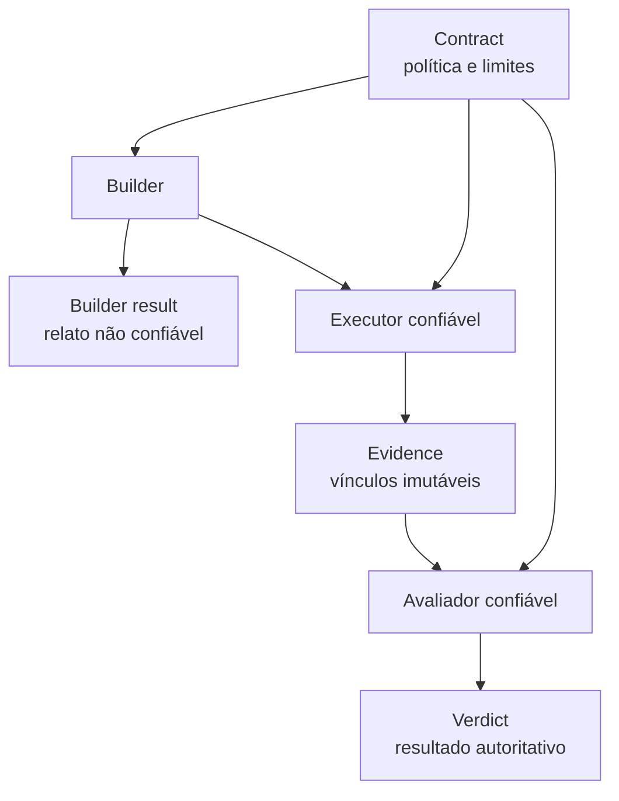

# engineering-loop-schemas

*[English](README.md)*

Contratos canônicos para loops de engenharia controlados por evidência: uma
fronteira neutra de provedor entre o que um agente de código relata, o que um
executor confiável realmente observou e o que um avaliador independente pode
aprovar.

O pacote distribui quatro documentos JSON Schema Draft 2020-12, modelos Python
imutáveis correspondentes, um validador estrutural somente com a biblioteca
padrão e um gerador determinístico de bundles vendorizados. Ele não executa
agentes nem promove código.

## Por que este projeto existe

Um agente afirmar que “os testes passaram” não constitui evidência. Um loop de
engenharia confiável precisa separar identidade e autoridade:

| Artefato | Produtor | Confiável para promoção? | Finalidade |
| --- | --- | ---: | --- |
| `contract` | Pessoa/política da plataforma | Sim | Define escopo, budgets, ações e hard gates |
| `builder-result` | Agente de código | Não | Registra o relato não autoritativo do builder |
| `evidence` | Executor confiável | Sim | Vincula código, política, ambiente, argv, terminação e hashes |
| `verdict` | Avaliador confiável | Sim | Avalia a evidência contra todos os gates do contrato |



O builder não pode produzir a `evidence` nem o `verdict` que certifica seu
próprio candidato. Gate ausente ou não verificável falha de forma fechada.

## Invariantes de segurança e integridade

- O JSON Schema canônico é a fonte de verdade estrutural. O avaliador stdlib lê
  esses arquivos e se recusa a executar se surgir uma regra que ele não saiba
  aplicar.
- A versão do documento representa o wire format, não a versão do pacote
  Python.
- A evidência confiável registra identidade do repositório, OIDs Git completos,
  digest da árvore candidata, contrato, política, ambiente do executor e argv
  shell-free de cada comando.
- `EXITED` exige um código de saída inteiro real. `TIMED_OUT`, `CANCELLED` e
  `OUTPUT_LIMIT` exigem `null`.
- stdout, stderr e a especificação imutável do gate têm hashes separados.
- Um `PASS` só pode usar `SUCCEEDED` ou `NO_OP` e não pode conter gate reprovado.
- A validação entre documentos exige exatamente um resultado para cada hard
  gate do contrato; gates ausentes, duplicados ou não declarados são rejeitados.
- A proveniência do bundle deve coincidir com `pyproject.toml`, o `HEAD` Git
  exato, o origin configurado e uma working tree limpa.

## Versões dos documentos

| Documento | Versão do wire format | Observação |
| --- | ---: | --- |
| `contract` | `1.0.0` | Contrato report-only existente |
| `builder-result` | `1.0.0` | Não autoritativo; agora exige SHAs completos |
| `evidence` | `2.0.0` | Repositório/política, OIDs completos, ambiente e argv estruturado |
| `verdict` | `2.0.0` | Hash do contrato, OID completo e consistência entre status e estado |

Cada schema usa `const` para a própria versão. Assim, um consumidor consegue
selecionar um parser compatível antes de confiar no documento. As alterações
incompatíveis estão em [MIGRATION.md](MIGRATION.md).

## Estrutura

```text
schemas/                         contratos canônicos e neutros de linguagem
src/loop_schemas/
  models.py                      dataclasses frozen e slotted
  _stdlib_jsonschema.py          avaliador fail-closed dos keywords suportados
  schema_resources.py            API para schemas instalados
  validate_contract.py           CLI e API de validação
scripts/render_vendor_bundle.py  vendorização determinística com proveniência
examples/
  harness-self-improvement.yaml
  trusted-evidence.json
  trusted-verdict.json
tests/
```

O wheel inclui os quatro schemas em `loop_schemas/schemas/`; o consumidor não
precisa ter um checkout do repositório.

## Validar documentos

Para validar o contrato de exemplo:

```bash
uv sync --all-groups
uv run python -m loop_schemas.validate_contract \
  examples/harness-self-improvement.yaml
```

APIs de biblioteca:

```python
from loop_schemas import load_schema
from loop_schemas.validate_contract import (
    validate,
    validate_builder_result,
    validate_evidence,
    validate_verdict,
)

contract_errors = validate(contract)
evidence_errors = validate_evidence(evidence)
builder_errors = validate_builder_result(builder_result)
verdict_errors = validate_verdict(verdict, contract=contract)

evidence_schema = load_schema("evidence")
```

Uma lista vazia significa que o documento é válido. Erros estruturais incluem o
caminho JSON. A validação do contrato também verifica:

- sobreposição literal entre globs de allowlist e denylist;
- sobreposição entre ações permitidas e negadas;
- budgets positivos;
- nomes de hard gates suportados;
- requisitos específicos do tipo de trigger.

`validate_verdict(..., contract=contract)` também confere a identidade do
contrato e a cobertura exata do conjunto de gates.

Entrada JSON e toda a validação estrutural usam apenas a biblioteca padrão.
Entrada YAML fica disponível quando PyYAML está instalado.

## Exemplos de evidência e veredito

[trusted-evidence.json](examples/trusted-evidence.json) mostra o envelope
completo da execução confiável. Ele usa `argv` shell-free, não uma string de
exibição, e vincula todos os insumos relevantes por identidade completa ou
SHA-256.

[trusted-verdict.json](examples/trusted-verdict.json) mostra um resultado
autoritativo correspondente. `evidence_sha256` é calculado sobre bytes JSON
canônicos conforme RFC 8785/JCS; produtores não devem usar a formatação visual
incidental no cálculo.

Toda execução concluída termina em um estado:

| Status | Estados finais permitidos |
| --- | --- |
| `PASS` | `SUCCEEDED`, `NO_OP` |
| `NEEDS_WORK` | `NO_PROGRESS`, `VERIFY_FAILED`, `POLICY_BLOCKED`, `BUDGET_EXCEEDED` |
| `ESCALATE` | `ESCALATED`, `INFRA_FAILED` |

`NO_PROGRESS` significa que a avaliação confiável não encontrou melhora em
relação ao baseline. Diffs equivalentes ou assinaturas de falha repetidas são
sinais internos de estagnação, não estados finais por si só. Veja o
[ADR 0001](docs/adr/0001-no-progress-and-stall-signals.md).

## Vendorizar em um harness

O renderizador produz um pacote stdlib-only autocontido com modelos, validador,
carregador de recursos, schemas e manifesto com hashes:

```bash
uv run python scripts/render_vendor_bundle.py \
  --target build/vendor/_vendor_loop_schemas \
  --source-commit "$(git rev-parse HEAD)"

uv run python scripts/render_vendor_bundle.py \
  --target build/vendor/_vendor_loop_schemas \
  --source-commit "$(git rev-parse HEAD)" \
  --check
```

A geração falha quando:

- a versão declarada difere de `pyproject.toml`;
- o commit declarado difere do `HEAD`;
- o origin difere do repositório declarado;
- arquivos rastreados ou não rastreados deixam a working tree suja.

O bundle completo é preparado antes da substituição do destino. O manifesto
protege cada arquivo Python e schema, registra todas as adaptações de import e,
durante `--check`, rejeita arquivos ausentes, inesperados, alterados ou links
simbólicos.

Não edite uma cópia vendorizada. Altere este repositório, publique uma release e
gere novamente cada consumidor a partir do commit completo da tag.

## Supply chain da release

Uma tag com versão semântica aciona `.github/workflows/release-evidence.yml`. O
workflow executa novamente o quality gate, confere se a tag corresponde à
versão do pacote, gera wheel e source distribution, produz checksums SHA-256,
cria um SBOM SPDX JSON e emite attestations de proveniência e SBOM assinadas
pelo GitHub. Todas as actions estão fixadas por commit completo.

O workflow preserva esses arquivos como evidência da release, mas não publica
no PyPI nem cria uma release no GitHub. A promoção continua sendo uma ação
explícita da pessoa mantenedora. Após uma execução por tag, valide uma
distribuição baixada com:

```bash
gh attestation verify dist/loop_schemas-*.whl \
  -R brunovicco/engineering-loop-schemas
```

## Desenvolvimento

```bash
uv lock --check
uv sync --frozen --all-groups
uv run ruff check .
uv run ruff format --check .
uv run pyright
uv run pytest
uv build
```

A CI cobre Python 3.12, 3.13 e 3.14. Os testes incluem comparação adversarial
com `jsonschema`, paridade entre modelos e schemas, conteúdo do wheel,
consistência do verdict, adulteração do bundle e verificação da proveniência da
fonte. A cobertura inclui o renderizador e exige no mínimo 90%.

## Escopo

O projeto permanece report-only. Ele define e valida artefatos; não executa um
loop de engenharia, modifica código de produto, cria ou promove candidatos,
faz merge, realiza deploy nem permite que um builder certifique a si próprio.
